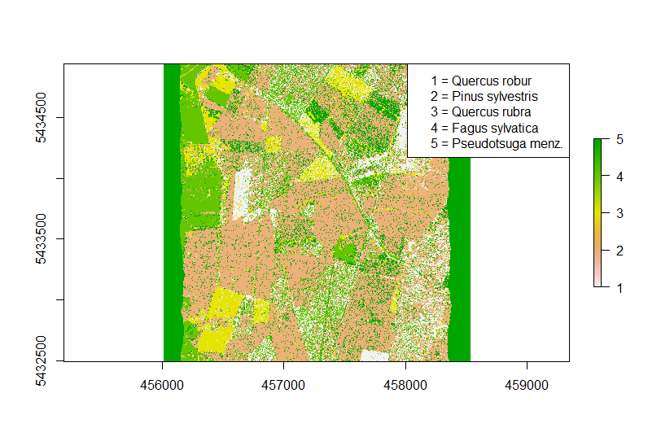

## Classification of tree species using hyperspectral data ##

### Overview ###

In this lecture you will learn how to use hyperspectral data in combination with a support vector machines (SVM) algorithm to create a tree species map from a hyperspectral HyMap image using a supervised classification. The learned steps will include:

- Loading a hyperspectral  image
- Visualizing a hyperspectral image and vegetation spectra extracted from pixels
- Conduct a supervised SVM classification using the original HyMap bands
- Applying a PCA transformation to the Hyperspectral image (feature extraction) 
- Conduct a supervised SVM classification using the PCA components as input
- Apply an additional feature selection to the PCA components and conduct a supervised SVM classification using an automatically selected subset of the PCA components

The datasets applied in this tutorial are available here:

[https://drive.google.com/file/d/1OkOcvNTDGR5PcBhress0pbwMP5wPqVui/view?usp=sharing](https://drive.google.com/file/d/1OkOcvNTDGR5PcBhress0pbwMP5wPqVui/view?usp=sharing)

### Datasets used in this Tutorial ###

In this tutorial we will make use of an airborne hyperspectral or imaging spectroscopy image that was collected with the HyMap sensor (**HyMap\_125bands\_Karlsruhe2.tif**). This dataset is comparable to a multispectral image but contains a lot more bands which continuously cover the spectra wavelengths regions between approximately 400 and 2400 nm. The HyMap image shows a forested area in the North of the German city Karlsruhe. The dataset has been described with more details in the following publications: 

Fassnacht, F. E.; Neumann, C.; Forster, M.; Buddenbaum, H.; Ghosh, A.; Clasen, A.; Joshi, P. K.; Koch, B. (2014). Comparison of feature reduction algorithms for classifying tree species with hyperspectral data on three central european test sites. IEEE Journal of Selected Topics in Applied Earth Observations and Remote Sensing, 7 (6), 2547–2561. doi:10.1109/JSTARS.2014.2329390

Ghosh, A.; Fassnacht, F. E.; Joshi, P. K.; Koch, B. (2014). A framework for mapping tree species combining Hyperspectral and LiDAR data: role of selected classifiers and sensor across three spatial scales. International journal of applied earth observation and geoinformation, 26, 49–63. doi:10.1016/j.jag.2013.05.017

Additionally, a point-Shapefile is provided which contains sample points (reference positions) for 5 tree species (50 points per species, 250 in total) (**tree\_species\_KA.shp**). These reference positions were collected using visual interpretation of high-resolution images in combination with reference tree species maps provided by the local forest administration. These reference tree species maps are also provided as tif-files (**Reference\_information.tif; Reference\_information2.tif**). The latter can used for comparison with the classification maps produced in the tutorial. 

### Step 1: Loading an visualizing the hyperspectral HyMap image and the reference dataset ###

As first step, load all necessary R packages by executing the following code:

	require(terra)
	require(e1071)
	require(caret)
	require(sf)
	require(matrixStats)
	require(RStoolbox)
	require(factoextra)
	require(VSURF)

R will give you a warning message in case a package is not installed yet. If this is the case, please install the packages either through the main menu of Rstudio by selecting **"Tools" =>** **"Install packages"** and then following the appearing dialogue, or by entering the corresponding R code to install the packages into the console. E.g., to install the package "raster" use the code:

	install.packages("terra")	

After all packages are successfully installed, we will load the hyperspectral image and the shapefile containing the reference information. You should already be familiar with the corresponding code in R from earlier practicals of the course.

	# change directory (depends on where you stored your data)
	setwd("D:/Diplomado/Tut_superv_class_hyper/2_data")
	
	# load hyperspectral image
	hym_img <- stack("HyMap_125bands_Karlsruhe2.tif")
	
	# load reference data
	ref <- readOGR(".", "tree_species_KA")

After loading the hyperspectral image, we can obtain some basic information about the data using some standard commands of the Raster package:

	# we can now obtain some information about the image using the following commands:
	
	# number of colums of the hyperspectral image
	ncol(hym_img)
	# number of rows of the hyperspectral image
	nrow(hym_img)
	# number of bands of the hyperspectral image
	nlyr(hym_img)
	# summary information of all bands
	summary(hym_img)
	# summary information of a specific band, here band number 5
	summary(hym_img[[5]])
	# check the geographic extent of the image
	ext(hym_img)
	# check the defined coordinate system
	crs(hym_img)

While we do not exlicitly need these commands right now, it is still important to know them because you will regularly confront situations where you need them for processing your images in an effective way. Next, we will plot our hyperspectral image (**hym\_img**) as well as the reference data stored in the loaded shapefile (**ref**).  You can see in the code below, that we will select the bands number 21, 14 and 7 to plot a RGB-composit of the hyperspectral image. This leads to an Color-Infrared-View of the image because the band 21 is located in the NIR, the band 14 in the red region and band 7 in the green region. We will furthermore plot the reference data on top of the image using the species information to color-code each sample. The species information is stored in the attribute table of the Shapefile in the column named "id" which can be accessed with the setting **col=ref@data$id**.

	# plot CIR view of hyperspectral image
	plotRGB(hym_img, r=21, g=14, b=7, stretch="hist")
	# add reference points
	par(new=T)
	plot(ref, col=ref$id, add=T)

This will result in the following plot:

In the given plot, coniferous stands are depicted in green and broadleaved stands in red. This is because broadleaved stands have a higher reflectance in the near-infrared region than coniferous stands. You can also see that the reference points are depicted in different colors and are mostly crowded in individual forest stands. This is due to the fact, that these stands contain mostly a single species and can hence serve as reliable reference areas to collect samples that we will use to train the algorithm. In total, we consider five tree species, that we will introduce later on. Already now, we can see that one species (Fagus sylvatica) is not occurring in pure stands (this can be seen because pure stands appear just in green or just in red colors). You can see that all the dark blue samples are occurring in rather heterogeneous stands with mixed green and red areas.

As next step, we will now extract the spectral values of the HyMap image at each of the 250 reference point locations. So we will have 50 spectral signatures for each tree species. To do this we run:

	# extract spectral signatures at the reference data points
	ref_data_tr <- extract(hym_img, ref, ID=F)

Depending on the performance of your computer, this will take a bit of time, as the image has quite a lot of bands. Once, we have extracted the values, the values will be available in a dataframe.

Now, we can have a look at the extracted spectral signature by running the plot command in a loop to plot all spectral signatures into the same plot window:

	# plot all spectra and color-code with species
	dev.off()
	for (i in 1:nrow(ref_data_tr)){
	
	  par(new=T) 
	  plot(1:125, ref_data_tr[i,], type="l", col=ref@data$id[i], ylim=c(0,6000), ylab="Reflectance", xlab="HyMap band")
	
	}
	
This will result in the following image:

What is not optimal in this graph is that the x-axis does not show the wavelengths, but the band number of the HyMap sensor. This can be fixed by providing the center-wavelengths of HyMap instead as an array instead of the simple sequence from 1 to 125 (the code part is: **1:125**) as done at the moment. However, because it is not really relevant for this tutorial, we will not spend more time on this for now.
	
In the plot, we used the species information to color-code the spectra, but as you can see this graph is quite chaotic, and it is hard to see where the spectra of one species ends and the spectra of another species start. All in all, there seems to be quite a heavy overlap between the spectral signatures of the five species. So let us try to make this plot a bit clearer by plotting the mean spectral signature of each species plus its standard deviations.

We will need a bit more code to do this. There are definitely ways to code this with less lines of code, however, the solution given below makes the logical flow quite clear and may be easier to understand for people who are not yet professionals in R. For detailed information, please read the comments in the code.

	##################################
	# plot mean + sd of each species
	##################################

	# The species information stored in the Shapefile is coded with numbers. Below you can see which species
	# belongs to which number code.
	
	# species:
	# id = 1 = Quercus robur/petreae (Common/Trembling Oak)
	# id = 2 = Pinus sylvestris (Pine) 
	# id = 3 = Quercus rubra (Red Oak)
	# id = 4 = Fagus sylvatica (European beech)
	# id = 5 = Pseudotsuga menziesii (Douglas fir)

	# in the first step, this information about the species will be attached to the dataframe
	# containing the spectral signatures at the reference plot locations:

	ref_data_tr$id <- ref@data$id

	# now we are ready to calculate the mean and standard deviation (sd) spectral signatures of each species 
	# to save the mean and sd signatures, we create an empty list object	
	meansd <- list()
	
	# then we run a loop in which we first build a subset of the spectral signatures dataframe so that the
	# subset only contains the spectra of a single species.
	for (i2 in 1:5){
	  
	  # build subset of the dataframe where the species id = i2 
	  sp <- ref_data_tr[ref_data_tr$id == i2,]
	  # from the remaining 50 spectral signatures of a single species, calculate the column mean and sd
	  means <- colMeans2(as.matrix(sp[,1:125]))
	  sds <- colSds(as.matrix(sp[,1:125]))
	  # bind the two arrays containing the mean and sd values
	  fin <- cbind(means, sds)
	  # save them to the list
	  meansd[[i2]] <- fin
	  # repeat with next species
	      
	}
	
	# now we are able to plot the mean and sd values of the five species

	# close any currently open plot window
	dev.off()
	# plot an "empty" plot by setting the color to white. This is a trick to avoid overlapping axes-titles in the for-loop below
	plot(1:125, meansd[[1]][,1], type="l", col="white", ylim=c(0,6000), ylab="Reflectance [10000=100%]", xlab="# Band")
	# add a legend indicating the species names
	legend("topright", legend=c("Quercus robur", "Pinus sylvestris", "Quercus rubra", "Fagus sylvatica", "Pseudotsuga menziesii"), col=c(1,2,3,4,5), lty=c(1,1,1,1,1)) 
	
	# plot the mean spectral signature as well as two additional signatures which show the mean - sd and mean + sd to create an interval in which most of the spectral signatures of the species are located.

	for (i3 in 1:5){
	  
	
	  par(new=T)
	  # plot mean spectral signature
	  plot(1:125, meansd[[i3]][,1], type="l", col=i3, ylim=c(0,6000), add=T, lwd=2, axes=F, ann=F)
	  par(new=T)
	  # plot mean spectral signature + sd values
	  plot(1:125, meansd[[i3]][,1]+meansd[[i3]][,2], type="l", col=adjustcolor(i3, alpha.f=0.5), ylim=c(0,6000), add=T, lty=2, axes=F, ann=F)
	  par(new=T)
	  # plot mean spectral signature - sd values
	  plot(1:125, meansd[[i3]][,1]-meansd[[i3]][,2], type="l", col=adjustcolor(i3, alpha.f=0.5), ylim=c(0,6000), add=T, lty=2, axes=F, ann=F)
	  
	
	}

This rather long code will lead to the following plot:

This plot is a lot clearer. We can see the mean spectral signatures of all broadleaved tree species (Quercus robur, Quercus rubra and Fagus sylvatica) have a higher reflectance amplitude than the two coniferous species (Pinus sylvestris and Pseudotsuga Menziesii). We can also see that the SD-values of the spectral signatures of the individual species overlap quite notably. This suggests that the classification might not be that easy. But let us explore, what can be achieved.

### Step 2: Tree species classification using the original HyMap bands  ###

We will now prepare and run the first classification approach using all 125 bands of the HyMap image. For this, we first prepare two variables. One contains all the spectral signatures of the training data (**trainval**) and one that contains the corresponding response value (the information to which tree species the sample belongs - coded as a number between 1 and 5) (**treespec**).

	############################################
	# prepare classification using original bands
	############################################
	trainval <- ref_data_tr[,1:125]
	treespec <- ref_data_tr$id
	
As we can see, we obtain both of these variables from the **ref\_dara\_tr** dataframe which contains the spectral signature in columns 1 to 125 and the reference data in column 126 (the latter can also be directly accessed via the column name).

Now we are ready to start the classification. As you might already know, machine learning algorithms such as support vector machines, typically require a parameter tuning. That is, we try to identify the optimal settings of the classification algorithm by splitting the dataset into several parts and then use some of these parts to train the classifier (with a set of parameters) and then validate them with another part which has not been used during training. By repeatedly varying the parameters, we can find a combination of parameters, that performs exceptionally well.

In the case of SVM we can vary two parameters: gamma and cost. **Gamma** defines how flexible the so-called hyperplane is allowed to be. The hyperplane is basically the separation-"line" between the different classes in the feature space. On the other hand, **cost** describes how strongly the classifier punishes a wrongly classified sample. If cost and/or Gamma is too high, there is a risk of overfitting - however, by applying datasplits during the grid search, overfitted models will lead to bad performances. By using an automated grid-search which varies the gamma and cost values within a user-defined range, it is possible to automatically search for a good gamma/cost combination in R. The corresponding code looks like this (this might take a while to run, as a lot of different models are examined here): 

	# set a seed to allow for reproducing the results
	set.seed(1173)
	# set a range of gamma and cost values to be tested in the parameter tuning
	gammat = seq(.1, .9, by = .1)
	costt = seq(1,128, by = 12)
	# check the parameters to be tested
	gammat
	costt	
	# run the parameter tuning
	tune1 <- tune.svm(trainval, as.factor(treespec), gamma = gammat, cost=costt)
	# plot the results of the parameter tuning
	plot(tune1)

As you can see we will test 9 different values for gamma and 11 different cost-values. In theory, it would of course be possible to test even more combinations but the ones selected here are working quite well from our experience. However, feel free to try out some higher and lower values if you are interested in the results. The code above will lead to the following plot:

This plot summarizes the performances obtained with the examined gamma and cost values. The legend is showing the error rate. So that means, the higher we set gamma, the larger the errors were during the parameter tuning. On the other hand, cost did not have a notable effect on the parameter tuning in the given example.

We will now extract the best identified gamma and cost value by running:
	
	gamma <- tune1$best.parameters$gamma
	cost <- tune1$best.parameters$cost

Then we are ready to train the SVM classification. We will train two different models, one model in which all available data will be used for training the model (maximizing the available information) and a second model which is additionally applying a 10-fold cross-validation which we can use to get an idea of how well the classification is able to classify the reference samples correctly.
	
	# train the model with all available samples
	model <- svm(trainval, as.factor(treespec), gamma = gamma, cost = cost, probability = TRUE)
	# train model with 5-fold cross-validation to get first impression on accuracies
	model2 <- svm(trainval, as.factor(treespec), gamma = gamma, cost = cost, probability = TRUE, cross=10)

This should run quite fast and we can not have a look at the model results by running:

	summary(model2)
	
This should show something like this:

So we can see that we have a mean overall accuracy of approximately 72%. This is not bad but also not really good. We can now also apply this classification model to the full image by running:

	# set output directory to save the classification map	
	setwd("D:/1_tree_species_Karlsruhe/2_data/results")
	# apply the classification model to the hyperspectral image using the predict function
	svmPred <- predict(hym_img, model, filename="tree_spec_map.tif", na.rm=TRUE, progress='text', format='GTiff', datatype='INT1U',overwrite=TRUE)

This process may take a few minutes depending on the speed of your computer. We can then plot the predicted map using:

	# plot the resulting tree species map
	plot(svmPred)
	legend("topright", legend=c("1 = Quercus robur", "2 = Pinus sylvestris", "3 = Quercus rubra", "4 = Fagus sylvatica", "5 = Pseudotsuga menziesii"))

This will result in the following tree species map:

On the first glance, this map looks quite plausible. We can see that many of the stands from which we collected the training data (and we hence know, that they are composed of a single species) appear quite homogeneous in the classification map. The quality of the map could be examined with more details by loading the map into QGIS and compare it to the reference maps provided with the tutorial materials and maybe also by comparing the map with additional high-resolution Google or Bing maps which can be visualized in QGIS as well. 

### Step 3: Tree species classification using PCA bands ###

One way to improve the accuracy of supervised classifications, particularly if working with hyperspectral data are feature extraction methods as they allow to compress the feature space and hence reduce colinearity of predictors. In the following we will apply the well-known principal component analysis (PCA) to the hyperspectral image to reduce the original 125 bands to a smaller number of bands carrying most of the variability contained in the image.

To apply a PCA to a raster dataset, we can use the **rasterPCA** function of the RStoolbox package. The function actually uses only a subset of pixels to calculate the PCA transformation and then only applies the transformation to the full raster stack. In the example below, we use 1000 sample points. The more points are used, the longer the PCA calculation may last. We also set the spca parameter to TRUE to scale all the bands (this is not absolutely necessary but may be reasonable to do in our case as for example vegetation spectra have differing reflectance value ranges in the visual and near-infrared region; by scaling all value ranges of the bands, such constant differences are smoothed out). If you are interested whether this has any effect, you can also re-run the code later and switch off the spca parameter. To run the PCA in R we execute the following code (this may take a while!):

	############################################
	# prepare classification using PCA
	############################################
	
	pca <- rasterPCA(hym_img, nSamples=5000, spca=T)

From the resulting **pca** object, we can extract the transformation model:

	pca_ras <- pca$map

As well as the new raster stack containing the PCA components (125 components/raster layers sorted from high to low information content)

	pca_mod <- pca$model
	
To check how much of the overall variability the individual components are carrying, we can have a look at an eigenvalue scree plot using the **fviz-eig** function from the factoextra package:

	fviz_eig(pca_mod)

This will result in the following plot:

As we can see, the first seven components seem to already carry the vast majority of the variability in the hyperspectral image. Starting from the 8th component, the information content seems to be rather low. However, we can also check this by plotting the individual components. We can for example compare the first three components with the last three components by running:

	x11()
	dev.off()
	par(mfrow=c(2,3))
	plot(pca_ras[[c(1:3, 123:125)]])

this will result in the following plot:

As we can see, the first three PCs show quite a lot of variation related to the image contents. PC3 does not show too many patterns, due to a few outlayer value in the urban area (the green dot) - but PC3 actually still does contain a lot variation (this would become visible if the image stretched would be adapted). On the other hand, the last three PCs seem to only show random noise. Based on the combination of the eigenvalue plot above and this visual examination we can now decide how many of the PCs we want to use in our classification. For now, we will simply select the first 15 components assuming that most of the variability in the image is covered by these components. Hence, we extract the values of the first 15 PCs from the reference sample locations using:

	# convert the raster object to a terra rast-object
	pca_ras <- rast(pca_ras)
 	# extract values
	trainval_pca <- extract(pca_ras[[1:15]], ref, ID=F)
	
Then, we run the same SVM classification as we did before, including also the parameter tuning:

	set.seed(1173)
	# parameter tuning
	gammat = seq(.1, .9, by = .1)
	costt = seq(1,128, by = 12)
	tune2 <- tune.svm(trainval_pca, as.factor(treespec), gamma = gammat, cost=costt)
	plot(tune2)
	# extract best parameters
	gamma2 <- tune2$best.parameters$gamma
	cost2 <- tune2$best.parameters$cost
	
	# train the model with all available samples
	model_pca <- svm(trainval_pca, as.factor(treespec), gamma = gamma2, cost = cost2, probability = TRUE)
	# train model with 10-fold cross-validation to get first impression on accuracies
	model_pca2 <- svm(trainval_pca, as.factor(treespec), gamma = gamma2, cost = cost2, probability = TRUE, cross=10)
	summary(model_pca2)
	
This will produce the following output (you will additionally see the plot from the parameter tuning, but you are already familiar with this step, so I will not repeat it here):

As we can see, the classification accuracy using only the first 15 PCA components as input is slightly better than the accuracy we obtained using all hyperspectral bands. Your results might vary slightly, depending on how you set your seed value in the function set.seed().

Finally, let us also produce a prediction map for this classification approach by running the following code:

	# set output directory
	setwd("D:/1_tree_species_Karlsruhe/2_data/results")
	# apply classifier to full image	
	svmPred_pca <- predict(pca_ras[[1:15]], model_pca, filename="tree_spec_map_pca.tif", na.rm=TRUE, progress='text', format='GTiff', datatype='INT1U',overwrite=TRUE)

We can also have a look at this map by running:

	dev.off()
	plot(svmPred_pca)
	legend("topright", legend=c("1 = Quercus robur", "2 = Pinus sylvestris", "3 = Quercus rubra", "4 = Fagus sylvatica", "5 = Pseudotsuga menz."))

Which will result in:

This map looks quite similar as the one from the preceeding classification. This is no surprise as the classification accuracies were also similar.

### Step 4: Tree species classification using a combination of feature selection (VSURF) and feature extraction (PCA) ###

In this final step of the Tutorial, we will now add another step. We will use the first 30 components of the PCA as our starting input dataset. Then we will run a feature selection algorithm on these 30 components and use the selected components to train the SVM classification.

First we select the first 30 components of the PCA raster stack and extract the corresponding values:

	set.seed(23)
	pca_ras2 <- pca_ras[[1:30]]
	trainval_pca2 <- extract(pca_ras2, ref, ID=F)

Then we run the feature selection algorithm VSURF. This algorithm is based on Random Forest and in some of our recent studies it performed quite well. Some more detailed descriptions on VSURF can be found in Genuer, R., Poggi, J.-M., Tuleau-Malot, C., 2015. VSURF: an r package for VariableSelection using random forests. R J. R Found. Statist. Comput. 7 (2), 19–33. Be aware that I set the option **parallel** to TRUE and **ncores** = 3. This means in this case, R will use 3 CPUs/cores to run the algorithm. In case your computer only has one core/CPU, you have to set parallel to FALSE. If you do not know how many cores your computer has, you can also try to run the code and if it fails, you can reduce the number of cores or deactivate the **parallel** setting.

	vsurf_pca <- VSURF(trainval_pca2, as.factor(treespec), ntree=500, parallel = T, ncores = 3)

The resulting vsurf_pca object contains three sets of selected variables. In the following we will focus on the predictor set optimized for prediction (see Tutorial 2 of this module for more information).
The column ids of this set of selected variables can be accessed with the command:

	vsurf_pca$varselect.pred

If we run it, we can see the following output:

We can see that the first three PCs got selected but also some lower ranked PCs like 26 and 27.

As next step, we will build a subset of our predictor feature space currently containing 30 PCs to a new dataframe containing only the 11 PCs selected by VSURF. For this we run:

	trainval_vsurf <- trainval_pca2[,vsurf_pca$varselect.pred]

These predictors are then used in the SVM classification workflow as we already know it from STEP 2 and 3:
	
	# run parameter tuning
	set.seed(1173)
	gammat = seq(.1, .9, by = .1)
	costt = seq(1,128, by = 12)
	tune3 <- tune.svm(trainval_vsurf, as.factor(treespec), gamma = gammat, cost=costt)
	plot(tune3)
	
	# take best parameters
	gamma3 <- tune3$best.parameters$gamma
	cost3 <- tune3$best.parameters$cost
	
	
	# train the model with all available samples
	model_vsurf <- svm(trainval_vsurf, as.factor(treespec), gamma = gamma3, cost = cost3, probability = TRUE)
	# train model with 5-fold cross-validation to get first impression on accuracies
	model_vsurf2 <- svm(trainval_vsurf, as.factor(treespec), gamma = gamma3, cost = cost3, probability = TRUE, cross=10)
	summary(model_vsurf2)

This will result in the following output:

As we can see, we could increase the classification accuracy by almost 10% with this additional feature selection step. This is quite a lot! As last step, we can now also produce the corresponding classification map by running:
	
	# set output directory to save classification map
	setwd("D:/1_tree_species_Karlsruhe/2_data/results")
	# apply classifier to full image
	svmPred_vsurf <- predict(pca_ras2[[vsurf_pca$varselect.pred]], model_vsurf, filename="tree_spec_map_vsurf.tif", na.rm=TRUE, progress='text', format='GTiff', datatype='INT1U',overwrite=TRUE)

And plot the map by running:

	dev.off()
	plot(svmPred_vsurf)
	legend("topright", legend=c("1 = Quercus robur", "2 = Pinus sylvestris", "3 = Quercus rubra", "4 = Fagus sylvatica", "5 = Pseudotsuga menz."))

Which will result in the following map:

We have now created three tree species maps using our hyperspectral image and the reference data. Feel free to have a closer look at the maps and think about how they differ and which one is agreeing best with the reference maps as well as with the visual impression when comparing the maps with high-resolution Google and Bing images in QGIS.

### Exercise ###

If you want to practice a bit more with the code, try to run another classification applying the VSURF variable selection to the original 125 bands of HyMap. How does this affect the classification accuracy?
